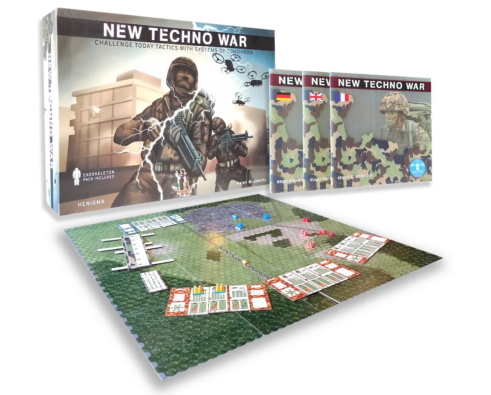

**New Techno War** is tabletop [wargame](https://deftech.ch/it/wargaming/) developed by [Helvetia Games](https://helvetia-games.ch/) in collaboration with [Armasuisse](https://www.ar.admin.ch/en/armasuisse-wissenschaft-und-technologie-w-t/home.html).

In this collaboration between IDSIA and Armasuisse, we aim to build a *companion agent* based on XAI that can help the players make strategical decisions and solving various combat scenario with different goals and constraints.
